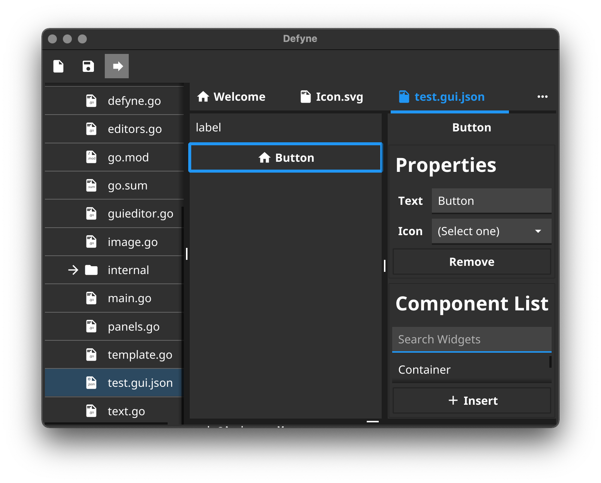

# DEFyne

This repo contains the work-in-progress Fyne IDE.

## Features

* Embedded terminal
* GUI Editor
* Image preview

## TODO

* Various types of editor
* Syntax highlighting
* Standard test/debug launchers

## Screenshot

## Installation

Can be installed directly using standard go tools:

	$ go install -v github.com/fyne-io/defyne@latest

## Contribution Setup

Clone the repo:

	$ git clone https://github.com/fyne-io/defyne

Move into the directory:

	$ cd defyne

Get the dependencies:

	$ go mod tidy

Build DEFyne

	$ go build

Run DEFyne, opening the current directory

	$ ./defyne .
